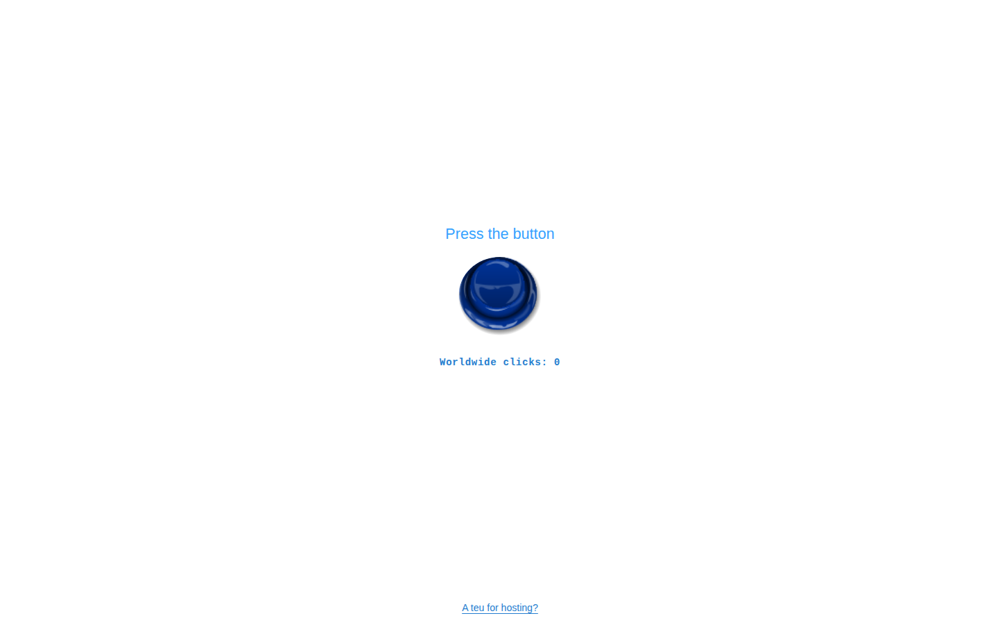

# teuteuteu.com



A modern restoration of the original 2000s Flash website. Press the blue button once to replay the original sound and its frame-accurate screen shakes—now rebuilt with accessible HTML, CSS, React and the Web Audio API.

**Live site:** [teuteuteu.com](https://teuteuteu.com)

## What is preserved

- Original button artwork and MP3 extracted from the SWF archive.
- The original single-play audio behaviour—no loop.
- 166 shake events reconstructed from the Flash timeline and synchronized to the audio clock.
- The deliberately empty, scroll-free, single-page composition.

## Modern additions

- Automatic browser-language detection with more than 50 locale variants and RTL support.
- A persistent global click counter backed by an atomic Supabase function.
- A scrolling supporter list populated by signed Buy Me a Coffee webhooks.
- A playful, translated hosting-cost panel with a tiny animated pixel cat.
- Keyboard, touch, reduced-motion and screen-reader support.
- PWA/offline assets, localized social previews, immutable static caching and layered abuse protection.

## Stack

- Next.js 16 and React 19
- TypeScript and native CSS
- Web Audio API
- Supabase Postgres
- Vitest and Playwright
- Docker for development and production
- GitHub Actions for verification and Vercel Git deployments for production

## Run locally in WSL

Docker development mode watches local files and recompiles automatically:

```bash
cp .env.example .env.local
docker compose up --build
```

Open [http://localhost:3000](http://localhost:3000).

Without Supabase variables, the interface and audio still work and the preview counter is kept in memory until the container restarts.

For a local production build:

```bash
docker compose -f docker-compose.production.yml up --build
```

## Environment variables

| Variable | Purpose |
| --- | --- |
| `SUPABASE_URL` | Server-side Supabase project URL |
| `SUPABASE_SECRET_KEY` | Preferred server-only Supabase secret |
| `SUPABASE_SERVICE_ROLE_KEY` | Legacy Vercel integration fallback |
| `CLICK_RATE_LIMIT_SECRET` | Secret used to hash visitor addresses |
| `CLICK_COUNTER_ENABLED` | Emergency read-only switch for the counter |
| `BUY_ME_A_COFFEE_WEBHOOK_SECRET` | Webhook signature verification secret |
| `NEXT_PUBLIC_SITE_URL` | Canonical production URL |

Never commit real values. Vercel injects production secrets and `.env.local` is ignored by Git.

## Quality checks

```bash
npm ci
npm run lint
npm run typecheck
npm test
npm run test:e2e
npm run build
```

The production branch is `main`. Every push is verified by GitHub Actions and automatically deployed through the repository's Vercel integration.

## Historical source

The extracted SWF components used for the restoration are kept under `sources/`. Thousands of duplicate rendered frames are intentionally excluded from Git; the retained ActionScript timeline is the source of truth for the shake reconstruction.

## License

See [LICENSE](LICENSE).
